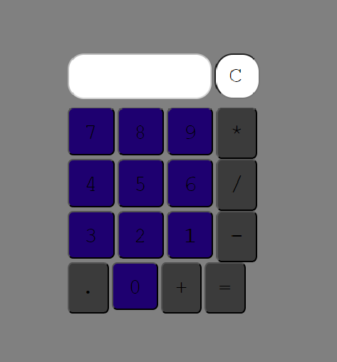

# Calc-JS
Calculadora feita baseada em JavaScricpt

## Funcionalidades

Só uma calculadora :)

## Tecnologias utilizadas
- JavaScript
- HTML
- CSS

## Como executar o projeto
1. Clone o repositório para sua máquina
2. Abra o arquivo index.html em um navegador web

## Autor
Eu :) com ajuda de alguns videos do YouTube 

